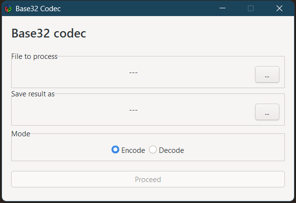
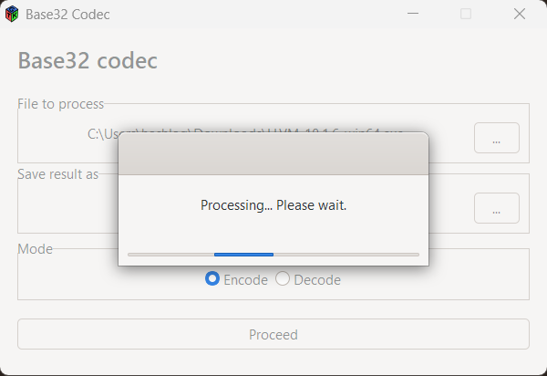
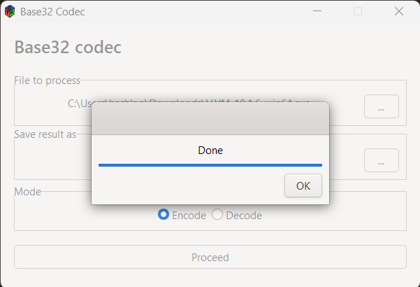
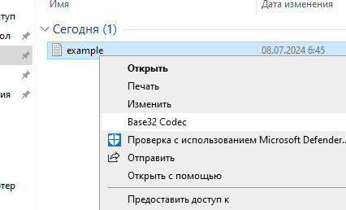

## GUI Base32 Encoder/Decoder

Simple C++ Gtk3 application capable of encoding and decoding files with [Base32](https://www.rfc-editor.org/rfc/rfc4648.html#page-8). Provides convenient GUI and Windows Explorer Context Menu integration.

This project includes custom implementations of Base32 encoding and decoding algorithms covered with UT via [the GoogleTest Framework](https://github.com/google/googletest).

Prebuilt Nullsoft Install System installer is available in [Releases]().

Nullsoft Install System script is also included and can be found inside `nsis/` subdirectory. 

